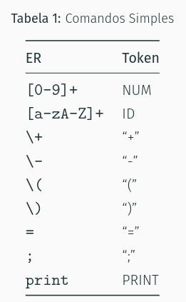
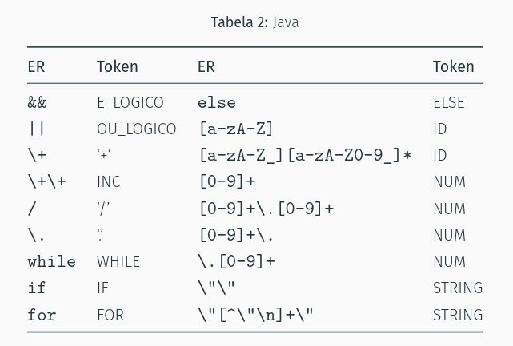

# Expressões Regulares

## Caracteres e Classes de caracteres
São o tipo mais simples de regex, sendo basiamente cadeias de um único caractere. Uma classe *[abx\]* denota o conjunto {"a", "b", "x"}.
Ex:
- \[a-z] denota qualquer caracter minúsculo
- [0-9] qualquer número
- Uma classe \[ab-fx] denota {"a", "b", "c", "d", "e", "f", "x"}
- Uma classe \[^ab-fx] denota o conjunto complemento da classe \[ab-fx] em relação ao
alfabeto

A **concatenação** consiste em um conjunto com cadeias de vários caracteres, onde cada um vem de uma das expressões concatenadas. Ex:
- \[a-z]\[0-9] resulta em a0, a1, a2...
- ... denota o conjunto de todas as cadeias de três caracteres (incluindo espaços!)

Uma barra | denota a **união** dos conjuntos das expressões. Ex:
- 0|1|2|3 = [0-3]

*: fecho de kleene
+: fecho positivo, ex: \[a-z]+ = {"a", "aa", "aaa", "aab", ...}

O operador **?** denota o conjunto da expressão que ele modifica, mais a cadeia vazia. Zero
ou um opcional. Ex:
- \[-+]?\d+ denota um número de pelo menos um dígito com ou sem sinal

## Especificação Léxica
É a sequência de regras de uma linguagem, onde cada regra é composta por uma expressão regular e um tipo de token. Ex:

